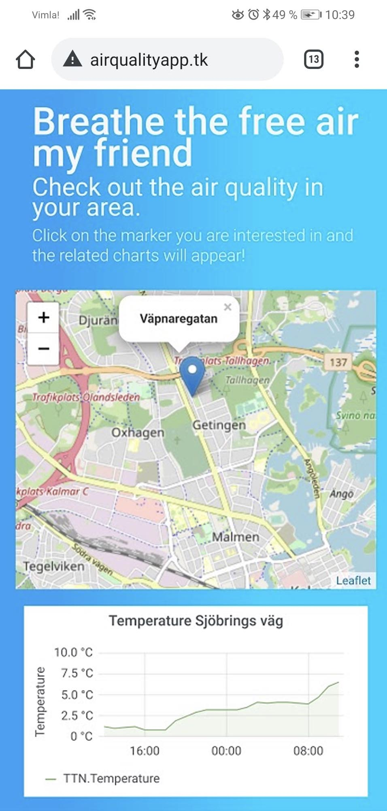
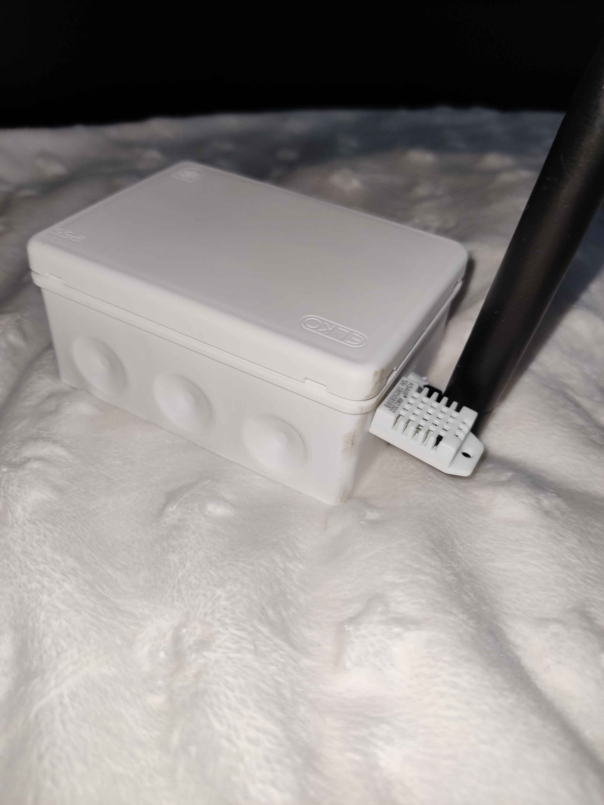
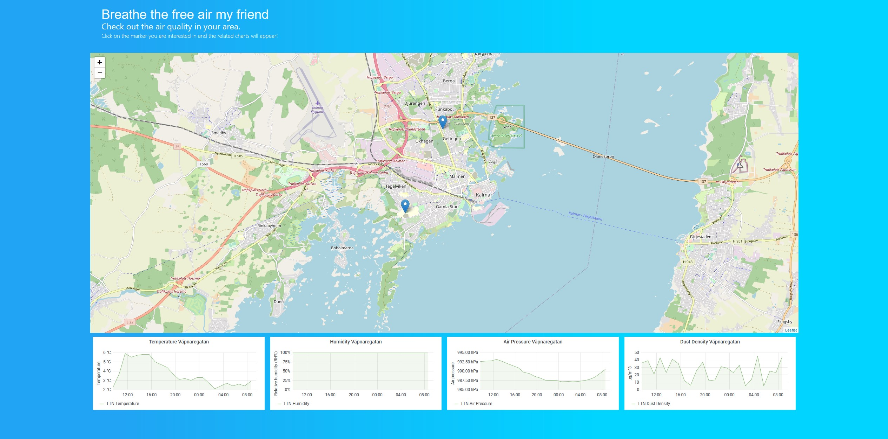
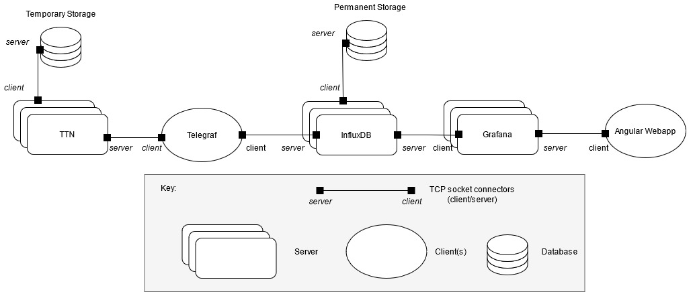
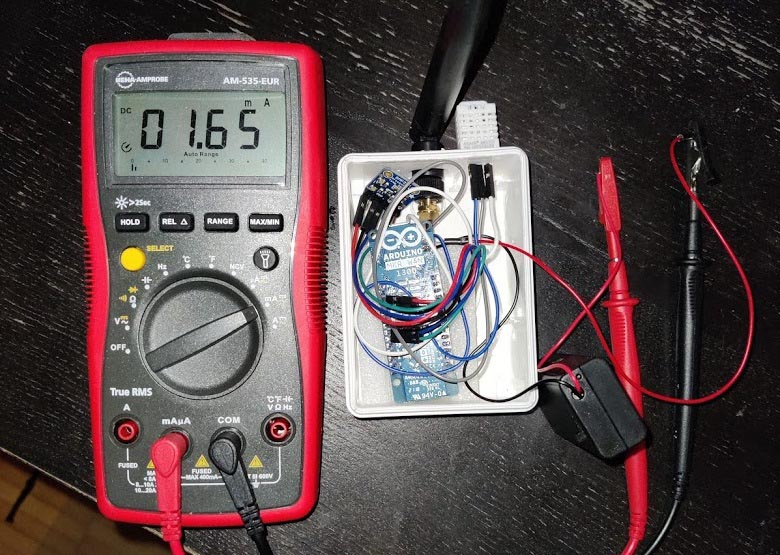
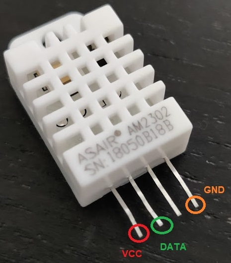
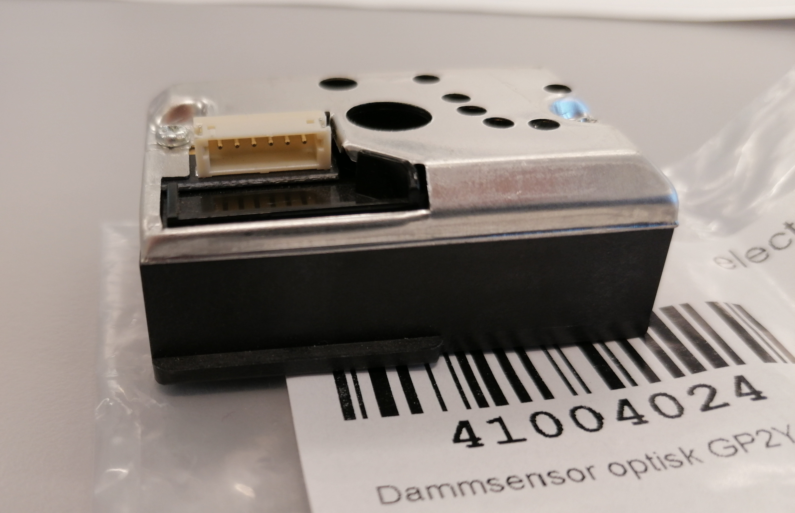
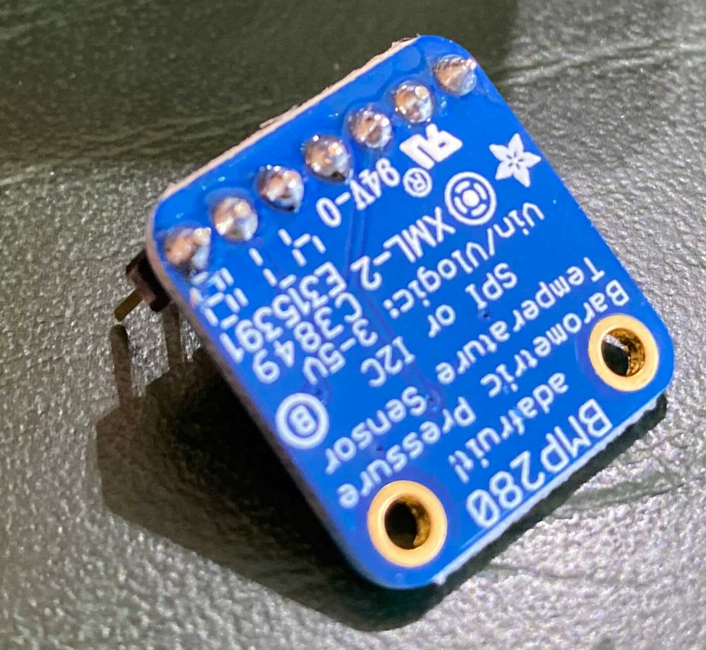

# Air Quality Measurement System - AQMS

> An end-to-end real time system measuring temperature, air pressure, humidity and PM10 particulates using low power devices. 
> 
> By Christoffer Lundström and Camilla Heiding 2021 @ Linnaeus University


<p style="text-align:center;">


</p>

*******
## Tables of contents 
 1. [Introduction](#intro)
 2. [Folder Structure](#structure)
 3. [Configuration](#config)
 4. [Images](#images)
*******


<div id='intro'/>  

## Introduction

Bad air quality is one of the larger issues in cities today. A common way to measure air quality is in PM10 and PM2.5.  These are air particulates that are caused by air pollution from a variety of sources ranging from vehicle exhausts, tyre friction to fuel combustion and naturally occurring particles suspended in air.  The impacts of these particles are severe and a known cause of multiple healtheffects such as bronchitis,  elevated blood pressure and premature death. Globally PM particles are  estimated to  account for  5% of lung  cancer deaths  and 3%  of cardiopulmonary diseases.

### Problem formulation
1.  Find a cheap but reliable solution to measure air quality such as dust density, temperature, humidity and air pressure.
2.  Collect and store data from a number of devices.
3.  Present measurements on a website with the location the device.


<p style="text-align:center;">

</p>


<div id='structure'/>

## Folder Structure

- Final sketch MKR1300 -  `MKR1300/sensors_lora_sleep/sensors_lora_sleep.ino`
- ESP32 sketches - `ESP32/src`
- LoRa config - `MKR1300/LoRA_config/LoRA_config.ino`
- TTN decoder - `MKR1300/decoder_TTN.js `
- Web app - `Frontend/`


## Configuration
<div id='config'/>
<p style="text-align:center;">
<br> Code infrastructure.
</p>

## HW & SW Dependencies

* Arduino MKR1300 (Update: MKR1310 is better suitable for this application (**consumes  ~20$\mu$A in deep sleep!**)
* [Angular CLI](https://github.com/angular/angular-cli) 7.3.8.
* Grafana 7.1.3
* InfluxDB 1.8
* Telegraf 1.17
* TTN account [The Things Network](http://thethingsnetwork.org)
* DHT22 sensor
* SHARP GP2Y1010AU0F optical dust sensor (or better)
* Adafruit BMP280 pressure and temperature sensor
* **LoRa COVERAGE!** Check [TTNMapper](http://ttnmapper.org) for your coverage.

## Development server

Run `ng serve` for a dev server. Navigate to `http://localhost:4200/`. The app will automatically reload if you change any of the source files.

## Production build

The build process is automated by a multi-stage ``Dockerfile`` which compiles an image with the build output from 
the Angular build with ahead of time compilation, production optimizations and configured with the latest version of nginx.

Below are the are the steps for building, deploying and stopping containers. 

### Build image
```
docker build -t production:latest .
```

### Deploying container

```
docker run -p 80:80 production:latest
```

### Stopping containers

Uses a filter to stop by tag name. An alternative is running docker ps and docker stop <container id>

```
docker stop $(docker ps -q --filter ancestor=production:latest )
```


## Images

<div id='images'/>
<p style="text-align:center;">
<br> Power consumption in sleep mode. Too high due to Murata module design flaw!
</p>

<p style="text-align:center;">
<br> DHT22 Temperature & humidity sensor. Digital output.
</p>

<p style="text-align:center;">
<br> SHARP dust sensor. Analog sampling required.
</p>

<p style="text-align:center;">
<br> Newly soldered BMP280 sensor. Connects via I2C interface.
</p>